The misplaced mouse Pax6 interneuron subclass: A cross-species
transcriptomic reassignment
================
Jonathan Werner
2026-08-11

This markdown file contains the code for generating all plots for the
publication: Werner, Suresh, French, and Gillis. The misplaced mouse
Pax6 interneuron subclass: A cross-species transcriptomic reassignment.
2026.

All data for these plots is provided at:
<https://github.com/JonathanMWerner/mammalian_brain_consensus_taxonomy/source_data/data_for_plots>

    ## 
    ## Attaching package: 'dplyr'

    ## The following objects are masked from 'package:stats':
    ## 
    ##     filter, lag

    ## The following objects are masked from 'package:base':
    ## 
    ##     intersect, setdiff, setequal, union

    ## Loading required package: grid

    ## ========================================
    ## ComplexHeatmap version 2.24.1
    ## Bioconductor page: http://bioconductor.org/packages/ComplexHeatmap/
    ## Github page: https://github.com/jokergoo/ComplexHeatmap
    ## Documentation: http://jokergoo.github.io/ComplexHeatmap-reference
    ## 
    ## If you use it in published research, please cite either one:
    ## - Gu, Z. Complex Heatmap Visualization. iMeta 2022.
    ## - Gu, Z. Complex heatmaps reveal patterns and correlations in multidimensional 
    ##     genomic data. Bioinformatics 2016.
    ## 
    ## 
    ## The new InteractiveComplexHeatmap package can directly export static 
    ## complex heatmaps into an interactive Shiny app with zero effort. Have a try!
    ## 
    ## This message can be suppressed by:
    ##   suppressPackageStartupMessages(library(ComplexHeatmap))
    ## ========================================

    ## ========================================
    ## circlize version 0.4.17
    ## CRAN page: https://cran.r-project.org/package=circlize
    ## Github page: https://github.com/jokergoo/circlize
    ## Documentation: https://jokergoo.github.io/circlize_book/book/
    ## 
    ## If you use it in published research, please cite:
    ## Gu, Z. circlize implements and enhances circular visualization
    ##   in R. Bioinformatics 2014.
    ## 
    ## This message can be suppressed by:
    ##   suppressPackageStartupMessages(library(circlize))
    ## ========================================

    ## 
    ## Attaching package: 'magrittr'

    ## The following object is masked from 'package:tidyr':
    ## 
    ##     extract

## Figure 1C

``` r
load(file = 'data_for_plots/namesake_marker_de.Rdata')
load(file = 'data_for_plots/primate_subclass_meta_markers.Rdata')

primate_pax6_PAX6_auroc = primate_subclass_meta_markers %>% filter(cell_type == 'Pax6' & gene == 'PAX6') %>% pull(auroc)

ggplot(mouse_name_sake_genes, aes(x = primate_auroc, y = mouse_auroc, color = cell_type, label = plot_label)) +
  geom_point(size = 3, alpha = .75) + ylim(0,1) + xlim(0,1) +
  geom_label_repel(min.segment.length = 0, max.overlaps = Inf, hjust = 1, direction = 'y', nudge_x = -.4,box.padding = .1, show.legend = F) +
  geom_vline(xintercept = .5, color = 'black', linetype = 'dashed', alpha = .5) +
  geom_hline(yintercept = .5, color = 'black', linetype = 'dashed', alpha = .5) +
  scale_color_manual(values = celltype_color_palette, name = 'Subclass', 
                     breaks = c('Sst','Sst Chodl','Pvalb','Chandelier','Lamp5 Lhx6','Lamp5','Vip','Sncg')) +
  ylab('Mouse AUROC') + xlab('Primate AUROC') +
  theme_bw()+ ggtitle('Subclass namesake gene DE') +
  theme(panel.grid.major = element_blank(),panel.grid.minor = element_blank()) +
  facet_wrap(~gene, nrow = 3) +
  geom_vline(data = subset(mouse_name_sake_genes, gene == "PAX6"), aes(xintercept = primate_pax6_PAX6_auroc), 
             color = 'red', linetype = 'longdash')
```

    ## Warning: Removed 63 rows containing missing values or values outside the scale range
    ## (`geom_label_repel()`).

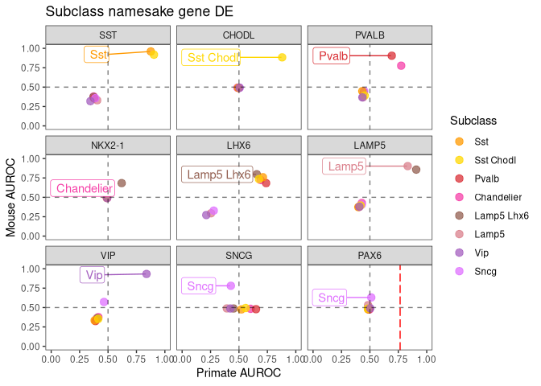<!-- -->

## Figure 1D

## Figure 1E

``` r
all_stats_df = readRDS('data_for_plots/all_stats_df.rds')

num_total_markers = c(1, 10, 25, 50, 100)
marker_colors = c('white','grey70','grey50','grey30','black')
names(marker_colors) = as.character(num_total_markers)

ggplot(all_stats_df, aes( x = avg_agg_exp, y =avg_enrich_exp , color =color_label, group = `Mouse Subclass`)) + 
  geom_point(shape = 21,size = 3, aes(fill = num_markers)) +
  geom_line(linewidth = 1) + geom_hline(yintercept = 1, color = 'black', linetype = 'dashed') +
  scale_color_manual(values = celltype_color_palette, name = 'Mouse Subclass') +
  scale_fill_manual(values = marker_colors, name = '# markers') +
  theme_bw() + ylab('Mouse expression enrichment') + xlab('Aggregate mouse expression') +
  facet_wrap(~`Primate Subclass Markers`, scales = 'free') + ggtitle('Primate marker expression in Mouse subclasses')
```

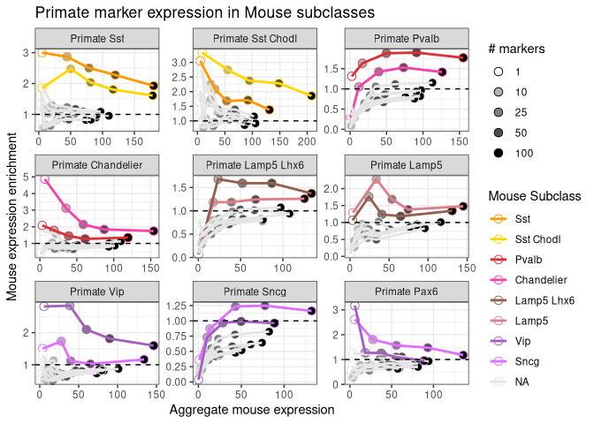<!-- -->

## Figure 1F

``` r
snapshot_df = all_stats_df %>% filter(`Primate Subclass Markers` %in% c('Primate Sncg','Primate Pax6') & `Mouse Subclass` == 'Sncg') %>%
  select(`Primate Subclass Markers`, `Mouse Subclass`, avg_enrich_exp, num_markers) %>% 
  tidyr::pivot_wider(names_from = `Primate Subclass Markers`, values_from = avg_enrich_exp)


ggplot(snapshot_df , aes(x = `Primate Sncg`, y = `Primate Pax6`, color = `Mouse Subclass`)) +
  geom_point(shape = 21,size = 5, aes(fill = num_markers)) +
  geom_abline(slope = 1, intercept = 0, color = 'red') +
  ylim(0, 2.8) + xlim(0, 2) +
  scale_color_manual(values = celltype_color_palette, name = 'Mouse Subclass') +
  scale_fill_manual(values = marker_colors, name = '# markers') +
  ggtitle('Mouse Sncg Subclass') + ylab('Primate Pax6 marker enrichment') + xlab('Primate Sncg marker enrichment') +
  theme_bw() +
  theme(panel.grid.major = element_blank(),
    panel.grid.minor = element_blank())
```

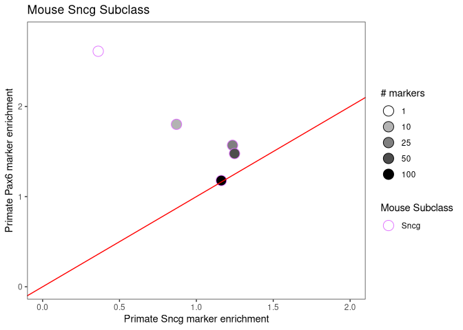<!-- -->

## Figure 2A

``` r
load(file = 'data_for_plots/avg_mouse_clust_primate_subclass_mappings_gaba.Rdata')
load(file = 'data_for_plots/cross_mammal_MN_results.Rdata')


keep_mclusters = max_avg_mapping %>% filter(orthology == 'high_orthology') %>% pull(mouse_mcluster)

r_names = rownames(mouse_clust_primate_sub_best_hits)
r_index = grepl('human', r_names) | grepl('chimp', r_names) | grepl('gorilla', r_names) | grepl('macaca', r_names) | grepl('marmoset', r_names) 
c_index = colnames(mouse_clust_primate_sub_best_hits) %in% keep_mclusters

test_metasubclass_hits = mouse_clust_primate_sub_best_hits[r_index, c_index]
m = test_metasubclass_hits 
#Cluster first, need to swap NAs to 0 for clustering
m[is.na(m)] <- 0
row_dendrogram <- stats::as.dendrogram(stats::hclust(dist(1-m), method = "average"))
col_dendrogram <- stats::as.dendrogram(stats::hclust(dist(1-t(m)), method = "average"))


#And the primate subclass colors and colors for each species
primate_subclass = rownames(test_metasubclass_hits)
primate_subclass = sapply(strsplit(primate_subclass, '|', fixed = T), '[[', 2)
primate_subclass = gsub('_',' ', primate_subclass)

primate_species = sapply(strsplit(rownames(test_metasubclass_hits), '|', fixed = T), '[[', 1)
primate_species = sapply(strsplit(primate_species, '_', fixed = T), '[[', 1)


row_ha = rowAnnotation(primate_subclass = primate_subclass,
                       primate_species = primate_species,
                       col = list(primate_subclass = celltype_color_palette,
                                  primate_species = c('human' = 'black', 'chimp' = 'grey25', 'gorilla' = 'grey40', 'macaca' = 'grey70', 'marmoset' = 'grey90')),
                       show_legend = F)

#Custom order for species
row_df = data.frame(species = primate_species, subclass = primate_subclass, row_index = 1:length(primate_subclass))
row_df = row_df %>% group_by(subclass) %>% arrange(match(species, c('human','chimp','gorilla','macaca','marmoset')), .by_group = T) %>%
  arrange(match(subclass, c("Pvalb", "Sst", 'Sst Chodl','Vip','Pax6', 'Sncg', 'Chandelier', 'Lamp5', 'Lamp5 Lhx6')))
row_custom_order = row_df$row_index


index = match(colnames(test_metasubclass_hits),  max_avg_mapping$mouse_mcluster )

col_ha = HeatmapAnnotation(orthologous_subclass = max_avg_mapping$primate_subclass[index],
                           col = list(orthologous_subclass = celltype_color_palette),
                           annotation_legend_param = list(orthologous_subclass = list(
                             at = c("Sst", "Sst Chodl", "Vip", 'Sncg', 'Pax6', 'Pvalb', 'Chandelier', 'Lamp5 Lhx6', 'Lamp5', 'none') )))

auroc_cols <- rev(grDevices::colorRampPalette(RColorBrewer::brewer.pal(11,"RdYlBu"))(100))

mouse_match_prim_sub = reshape2::melt(test_metasubclass_hits)
mouse_match_prim_sub$primate_subclass = sapply(strsplit(as.character(mouse_match_prim_sub$Var1), fixed = T, split = '|'), '[[', 2)

index = match(mouse_match_prim_sub$Var2, max_avg_mapping$mouse_mcluster)

mouse_match_prim_sub$orthologous_subclass = max_avg_mapping$primate_subclass[index]

mouse_match_prim_sub = mouse_match_prim_sub %>% group_by(Var2, Var1) %>% 
  summarise(mean_auroc = mean(value, na.rm = T),orthologous_subclass = orthologous_subclass) %>%
  filter(is.finite(mean_auroc)) %>%
  filter(mean_auroc == max(mean_auroc)) %>%
  filter(!duplicated(as.character(Var2))) %>%
  arrange(match(orthologous_subclass, 
                c("Pvalb", "Sst", 'Sst Chodl','Vip','Pax6', 'Sncg', 'Chandelier', 'Lamp5', 'Lamp5 Lhx6')), 
          desc(mean_auroc))
```

    ## `summarise()` has regrouped the output.
    ## ℹ Summaries were computed grouped by Var2 and Var1.
    ## ℹ Output is grouped by Var2.
    ## ℹ Use `summarise(.groups = "drop_last")` to silence this message.
    ## ℹ Use `summarise(.by = c(Var2, Var1))` for per-operation grouping
    ##   (`?dplyr::dplyr_by`) instead.

``` r
custom_order = match(as.character(mouse_match_prim_sub$Var2), colnames(test_metasubclass_hits))

ht_mc = ComplexHeatmap::Heatmap(test_metasubclass_hits, name = 'AUROC', col = auroc_cols,
                        row_order = row_custom_order, cluster_rows = F,
                        column_order = custom_order, cluster_columns = F,
                        column_names_gp = gpar(fontsize = 4),
                        row_names_gp = gpar(fontsize = 8),
                        left_annotation = row_ha, top_annotation = col_ha)

ht_mc = draw(ht_mc)
```

    ## Following `at` are removed: none, because no color was defined for
    ## them.
    ## Following `at` are removed: none, because no color was defined for
    ## them.
    ## Following `at` are removed: none, because no color was defined for
    ## them.

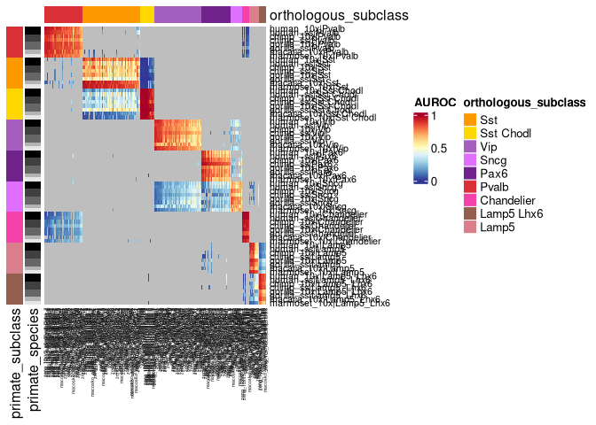<!-- -->

## Figure 2 B, D, and E

The Seurat object is quite large to save as source data

\##Figure 2C

``` r
load(file = 'data_for_plots/subclass_sankey.Rdata')

ggplot(sankey_interneuron_df, aes(x = x, 
               next_x = next_x, 
               node = node, 
               next_node = next_node,
               fill = factor(node),
               label = node)) +
  geom_sankey(flow.alpha = 0.5, node.color = 1) +
  geom_sankey_label(size = 3, color = 1 , show.legend = F) +
  scale_fill_manual(values = celltype_color_palette) +
  theme_sankey(base_size = 16) +
  guides(fill = guide_legend(title = "Subclass"))
```

    ## Warning: The `size` argument of `element_rect()` is deprecated as of ggplot2 3.4.0.
    ## ℹ Please use the `linewidth` argument instead.
    ## ℹ The deprecated feature was likely used in the ggsankey package.
    ##   Please report the issue at <https://github.com/davidsjoberg/ggsankey/issues>.
    ## This warning is displayed once per session.
    ## Call `lifecycle::last_lifecycle_warnings()` to see where this warning was
    ## generated.

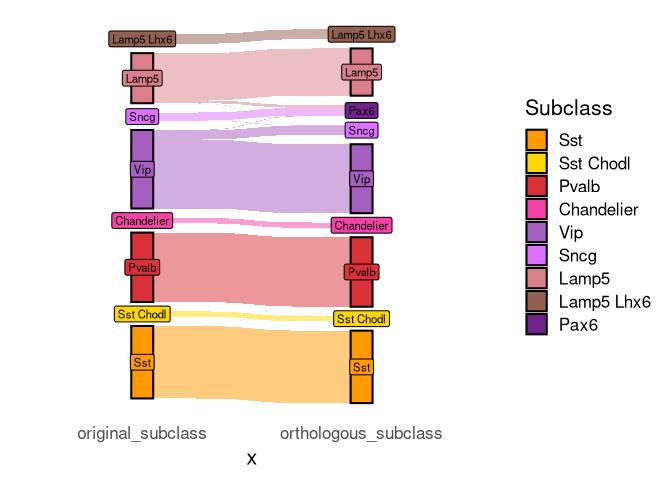<!-- -->

## Figure 2F

``` r
load(file = 'data_for_plots/integrated_mouse_taxonomy.Rdata')

hclust_avg <- hclust(as.dist(1-centroid_corr), method = 'ward.D2')

clust_index = match(colnames(centroid_corr), dataset_subclasses$study_clust)
original_subclass = dataset_subclasses$cell_subclass[clust_index]
orthologous_subclass = dataset_subclasses$primate_subclass[clust_index]
study_label = dataset_subclasses$study[clust_index]

study_colors = MetBrewer::met.brewer("Veronese", n=8, type="continuous")
study_colors = study_colors[1:8] 
names(study_colors) = c('tasic18','zeng_10x_cells','zeng_10x_nuclei','zeng_smart_cells',
                        'zeng_smart_nuclei','zeng_10xv2_wba','zeng_10xv3_wba','macosko_wba')


column_ha = HeatmapAnnotation(original_subclass = original_subclass, 
                              orthologous_subclass = orthologous_subclass,
                              study = study_label,
                              col = list(original_subclass = celltype_color_palette, 
                                         orthologous_subclass = celltype_color_palette,
                                         study = study_colors ),
                              show_legend = c("orthologous_subclass" = FALSE))


corr_cols <- rev(grDevices::colorRampPalette(RColorBrewer::brewer.pal(11,"RdYlBu"))(100))
cent_hm = ComplexHeatmap::Heatmap(centroid_corr, col = corr_cols, name = 'spearman' ,
                                  cluster_columns = hclust_avg,
                                  cluster_rows = hclust_avg,
                                  top_annotation = column_ha, column_title = 'integrated_interneurons',
                                  show_row_dend = F, show_row_names = F, show_column_names = F)
cent_hm = ComplexHeatmap::draw(cent_hm)
```

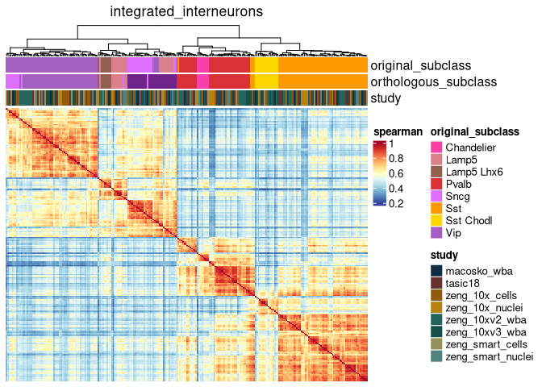<!-- -->

## Figure 2H

``` r
load(file = 'data_for_plots/mouse_meta_markers.Rdata')

plot_pareto_summary(mouse_subclass_meta_markers %>% filter(cell_type %in% c('Pax6','Sncg')), min_recurrence=4) +
  theme_bw() + scale_color_manual(values = celltype_color_palette) + ggtitle('Homologous Mouse subclass markers') + ylim(.5, 1) + xlim(0,5)
```

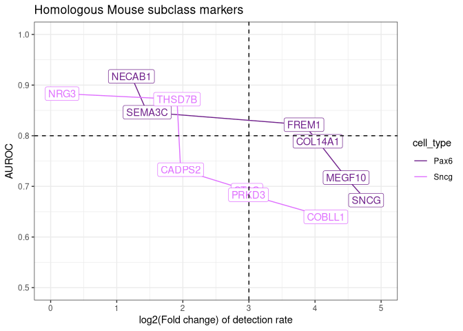<!-- -->

## Figure 2I

``` r
load(file = 'data_for_plots/primate_subclass_meta_markers.Rdata')

human_de_counts = rowSums(primate_subclass_meta_markers  %>% select(human_10x, human_ss))
chimp_de_counts = rowSums(primate_subclass_meta_markers  %>% select(chimp_10x, chimp_ss))
gorilla_de_counts = rowSums(primate_subclass_meta_markers  %>% select(gorilla_10x, gorilla_ss))
macaca_de_counts = primate_subclass_meta_markers$macaca_10x
marmoset_de_counts = primate_subclass_meta_markers$marmoset_10x

#Getting genes DE in at least 1 dataset per species
cross_species_de_index = human_de_counts >= 1 & chimp_de_counts >= 1 & gorilla_de_counts >= 1 & macaca_de_counts >= 1 & marmoset_de_counts >= 1


plot_pareto_summary(primate_subclass_meta_markers[cross_species_de_index, ] %>% filter(cell_type %in% c('Pax6','Sncg')), min_recurrence=0) +
  theme_bw() + scale_color_manual(values = celltype_color_palette) + ggtitle('Homologous Primate subclass markers') + ylim(.5, 1) + xlim(0,4)
```

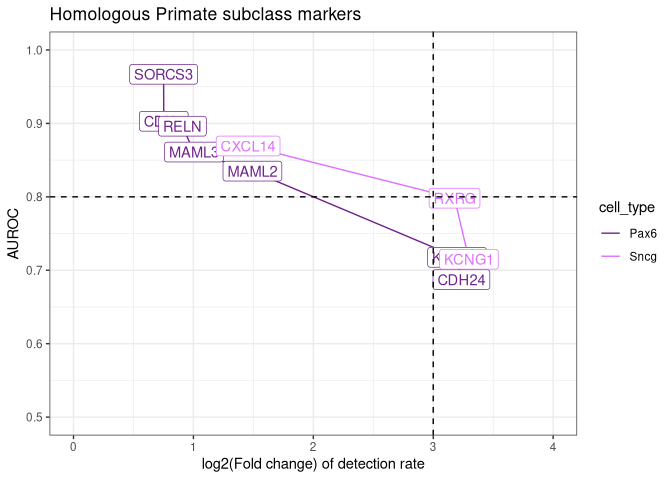<!-- -->

## Figure 2J

``` r
load(file = 'data_for_plots/mammal_subclass_meta_markers.Rdata')

mouse_de_counts = rowSums(mammal_subclass_meta_markers %>% select(tasic18, zeng_10x_cells, zeng_10x_nuclei, zeng_smart_cells, zeng_smart_nuclei, zeng_10xv2_wba, zeng_10xv3_wba, macosko_wba))

human_de_counts = rowSums(mammal_subclass_meta_markers %>% select(human_10x, human_ss))
chimp_de_counts = rowSums(mammal_subclass_meta_markers %>% select(chimp_10x, chimp_ss))
gorilla_de_counts = rowSums(mammal_subclass_meta_markers %>% select(gorilla_10x, gorilla_ss))
macaca_de_counts = mammal_subclass_meta_markers$macaca_10x
marmoset_de_counts = mammal_subclass_meta_markers$marmoset_10x


#Getting genes DE in at least 1 dataset per species
cross_species_de_index = mouse_de_counts >= 1 & human_de_counts >= 1 & chimp_de_counts >= 1 & gorilla_de_counts >= 1 & macaca_de_counts >= 1 & marmoset_de_counts >= 1

plot_pareto_summary(mammal_subclass_meta_markers[cross_species_de_index, ] %>% filter(cell_type %in% c('Pax6','Sncg')), min_recurrence=6) +
  theme_bw() + scale_color_manual(values = celltype_color_palette) + ggtitle('Homologous Primate-Mouse subclass markers') + ylim(.5, 1) + xlim(0,4)
```

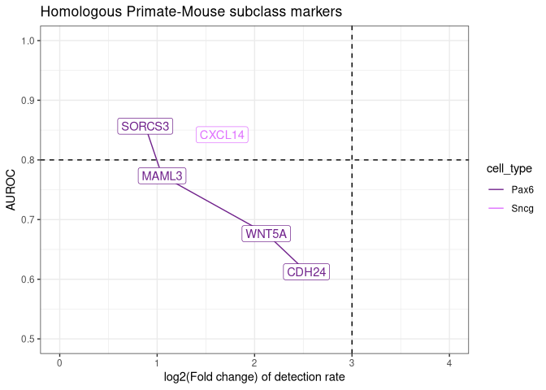<!-- -->

## Figure 3A

Seurat object is quite large to save as source data

## Figure 3B

``` r
load( file = 'data_for_plots/main_ion_channel_heatmap.Rdata')

index = match(colnames(mean_exp_cpm_df) , clust_to_subclass_df$cell_cluster_study)

column_annot = HeatmapAnnotation(mouse_subclass = clust_to_subclass_df$cell_subclass[index],
                                 homologous_subclass = clust_to_subclass_df$primate_subclass[index],
                                 col = list(mouse_subclass = celltype_color_palette,
                                            homologous_subclass = celltype_color_palette))

set.seed(123)
h2 = Heatmap(mean_exp_cpm_df, name = 'z-scored Mean CPM',
        show_row_names = T, show_row_dend = F, show_column_names = F,
        clustering_method_rows = 'ward.D2', clustering_method_columns = 'ward.D2',
        top_annotation = column_annot, row_names_gp = grid::gpar(fontsize = 8),
        column_title = 'Ion channel GO term genes')
h2 = draw(h2)
```

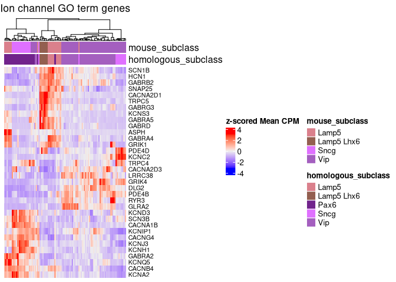<!-- -->

## Figure 3C and D

``` r
load(file = 'data_for_plots/omega_ephys_scatter.Rdata')

par(pty= 's')
plot(res_mouse$omega2, res_primate$omega2, main = 'Electrophysiology features', 
     ylab = 'Variance explained by homologous subclasses', 
     xlab = 'Variance explained by original subclasses', xlim = c(0,1), ylim = c(0,1) )
abline(a = 0, b = 1, col = 'red', lty = 'dashed')
```

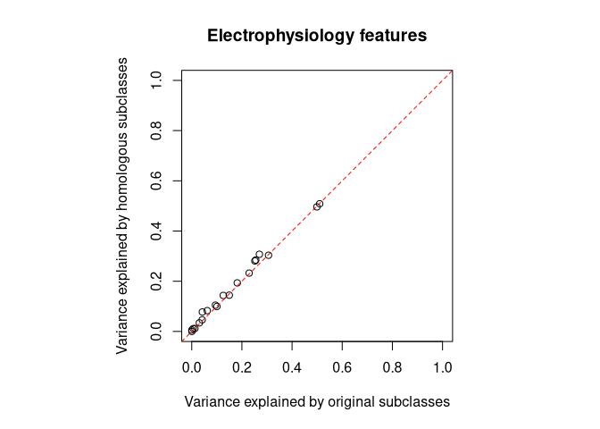<!-- -->

``` r
load(file = 'data_for_plots/omega_expression_scatter.Rdata')

par(pty= 's')
plot(res_exp_mouse$omega2, res_exp_primate$omega2, main = 'Transcriptomic features', 
     ylab = 'Variance explained by homologous subclasses', 
     xlab = 'Variance explained by original subclasses', xlim = c(0,1), ylim = c(0,1) )
abline(a = 0, b = 1, col = 'red', lty = 'dashed')
```

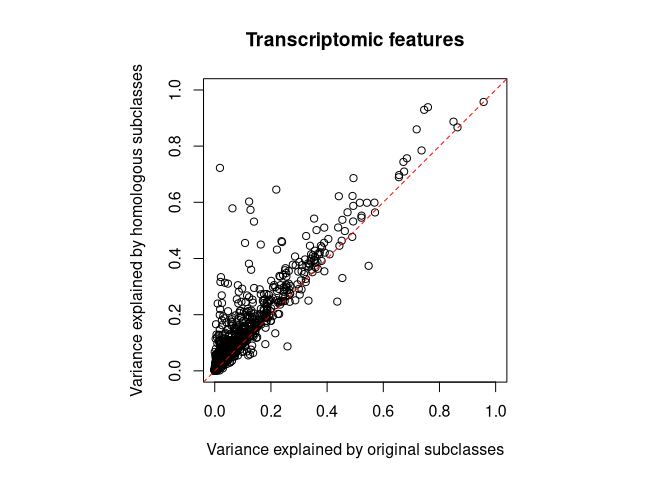<!-- -->

## Figure 3E

``` r
load(file = 'data_for_plots/mouse_ephys_corr_heatmap.Rdata')

ephys_dist_mat = as.dist(1- ephys_correlation_mat)

index = match(colnames(ephys_correlation_mat), mouse_patch_data$cell_specimen_id)

corr_mouse_subclass = mouse_patch_data$mouse_subclass[index]
corr_primate_subclass = mouse_patch_data$primate_subclass[index]

top_annot = HeatmapAnnotation(mouse_subclass = corr_mouse_subclass, homologous_subclass = corr_primate_subclass,
                              col = list(mouse_subclass = celltype_color_palette, homologous_subclass = celltype_color_palette))


corr_cols <- rev(grDevices::colorRampPalette(RColorBrewer::brewer.pal(11,"RdYlBu"))(100))
Heatmap(ephys_correlation_mat , name = 'spearman', col = corr_cols,
        clustering_distance_rows = ephys_dist_mat, use_raster = T,
        clustering_distance_columns = ephys_dist_mat,
        clustering_method_rows = 'ward.D2', clustering_method_columns = 'ward.D2',
        show_row_names = F, show_column_names = F,
        top_annotation = top_annot, column_title = 'Cell similarity over electrophysiology features')
```

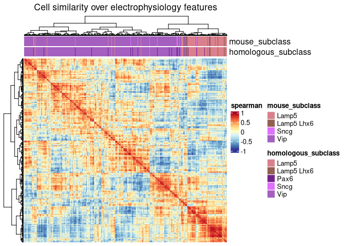<!-- -->

## Figure 3F

``` r
load(file = 'data_for_plots/exp_corr_heatmap.Rdata')

dist_exp_cor_mat = as.dist(1- exp_cor_mat)

index = match(colnames(exp_cor_mat), rownames(current_metadata))
exp_mouse_subclass = current_metadata$cell_subclass[index]
exp_primate_subclass = current_metadata$primate_subclass[index]


top_annot_exp = HeatmapAnnotation(mouse_subclass = exp_mouse_subclass, homologous_subclass = exp_primate_subclass,
                                   col = list(mouse_subclass = celltype_color_palette, homologous_subclass = celltype_color_palette))

corr_cols <- rev(grDevices::colorRampPalette(RColorBrewer::brewer.pal(11,"RdYlBu"))(100))
Heatmap(exp_cor_mat , name = 'spearman',use_raster = F, col = corr_cols,
        clustering_distance_rows = dist_exp_cor_mat,
        clustering_distance_columns = dist_exp_cor_mat,
        clustering_method_rows = 'ward.D2', clustering_method_columns = 'ward.D2',
        show_row_names = F, show_column_names = F,
        top_annotation = top_annot_exp, column_title = 'Cell similarity over transcriptomic features (top 25 hvgs)')
```

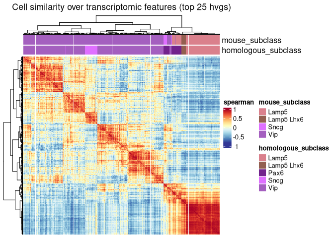<!-- -->

## Figure 3 G and H

``` r
load( file = 'data_for_plots/cge_pax6_distinguishing_features.Rdata')

par(mar = c(4, 10, 2, 1))
barplot(-1*log10(plotting_feature_pval+1e-10), 
        names.arg = names(plotting_feature_pval),
        las = 2, horiz = T, cex.names = .75, main = 'All CGE vs Homologous Pax6')
abline(v = -1*log10(0.05), col = 'red')
```

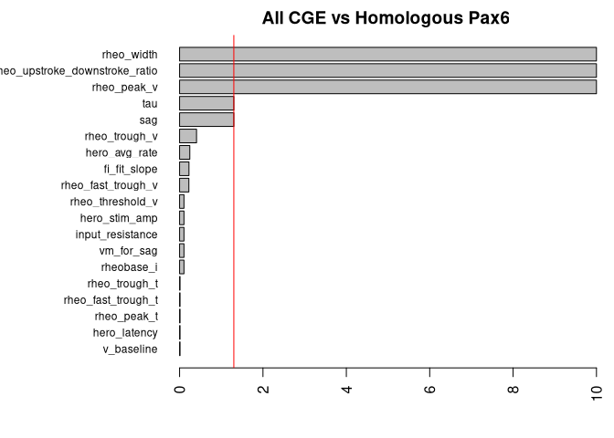<!-- -->

``` r
ggplot(sig_subset, aes(x = feature, y = value, color = label)) + geom_boxplot() + facet_wrap(~feature, scales = 'free') +
  scale_color_manual(values = c('Pax6' = celltype_color_palette[['Pax6']], 'non-Pax6 CGE' = 'grey20')) + theme_bw()
```

    ## Warning: Removed 5 rows containing non-finite outside the scale range
    ## (`stat_boxplot()`).

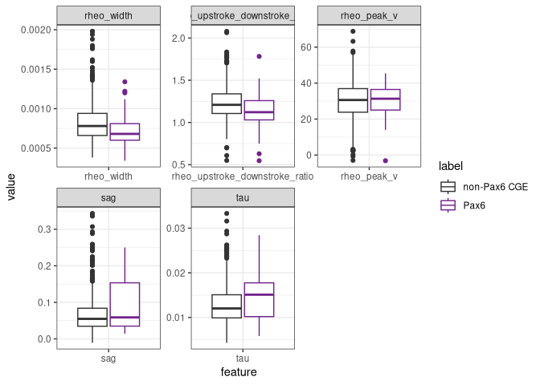<!-- -->

## Figure 3I

``` r
load( file = 'data_for_plots/mge_pax6_distinguishing_features.Rdata')


ggplot(sig_subset, aes(x = feature, y = value, color = label)) + geom_boxplot() + facet_wrap(~feature, scales = 'free') +
  scale_color_manual(values = c('Pax6' = celltype_color_palette[['Pax6']], 'MGE' = 'grey20')) + theme_bw()
```

    ## Warning: Removed 15 rows containing non-finite outside the scale range
    ## (`stat_boxplot()`).

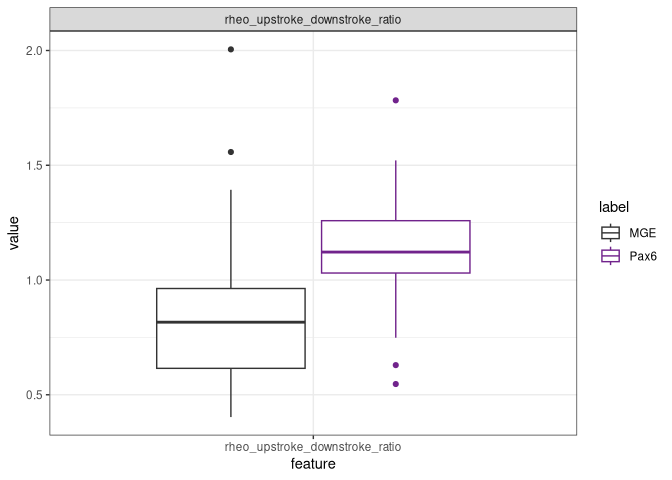<!-- -->

## Figure 4 A and B and C

``` r
load(file = 'data_for_plots/spatial_neighborhood.Rdata')
load(file = 'data_for_plots/spatial_annotations.Rdata')
load(file = 'data_for_plots/spatial_layer_source_data.Rdata')

#heatmap function
make_neighborhood_profile_heatmap <- function(
  all_profiles,
  Zeng_calls_direct,
  split_counts,
  celltype_color_palette,
  number_of_neighbors_profiled = 100,
  draw_heatmap = TRUE
) {
  CGE_supertypes <- Zeng_calls_direct %>%
    filter(class_label == "CTX-CGE GABA") %>%
    pull(supertype_label) %>%
    unique()

  MGE_supertypes <- Zeng_calls_direct %>%
    filter(class_label == "CTX-MGE GABA") %>%
    pull(supertype_label) %>%
    unique()

  mat_wide <- all_profiles %>%
    # filter(!target_level %in% no_signal_celltypes & target_subtype %in% CGE_supertypes) %>%
    select(target_subtype, target_level, mean_prop) %>%
    group_by(target_subtype, target_level) %>%
    summarise(prop = sum(mean_prop, na.rm = TRUE), .groups = "drop") %>%
    pivot_wider(
      names_from  = target_level,
      values_from = prop,
      values_fill = 0
    )

  mat_wide <- mat_wide %>%
    select(target_subtype, where(~ is.numeric(.x) && sum(.x, na.rm = TRUE) != 0))

  # Row metadata aligned to the original matrix row order
  row_meta <- all_profiles %>%
    distinct(target_subtype, cell_subclass, primate_subclass) %>%
    slice(match(mat_wide$target_subtype, target_subtype))

  row_meta$GE_origin <- "MGE"
  row_meta$GE_origin[row_meta$cell_subclass %in% c("Lamp5", "Vip", "Sncg")] <- "CGE"

  mat <- mat_wide %>%
    select(-target_subtype) %>%
    as.matrix()

  rownames(mat) <- mat_wide$target_subtype

  # Switch rows and columns
  mat <- t(mat)

  # ---- 2) Colors for annotations ----
  subclass_levels <- sort(unique(row_meta$cell_subclass))
  primate_levels  <- sort(unique(row_meta$primate_subclass))
  shared_levels   <- sort(unique(c(subclass_levels, primate_levels)))

  shared_cols <- setNames(
    colorRampPalette(brewer.pal(12, "Set3"))(length(shared_levels)),
    shared_levels
  )

  subclass_cols <- shared_cols[subclass_levels]
  primate_cols  <- shared_cols[primate_levels]

  # ---- 3) Optional marking bar ----
  markers <- split_counts %>%
    pull(cell_cluster) %>%
    unique()

  zeng_switch_vec <- factor(
    ifelse(colnames(mat) %in% markers, "marked", "other"),
    levels = c("other", "marked")
  )

  zengswitch_cols <- c(other = "white", marked = "black")

  col_anno <- HeatmapAnnotation(
    `Ganglionic Eminence` = row_meta$GE_origin,
    `Mouse subclass` = row_meta$cell_subclass,
    `Homologous subclass` = row_meta$primate_subclass,
    `Subclass switch` = zeng_switch_vec,
    col = list(
      `Ganglionic Eminence` = c("CGE" = "darkviolet", "MGE" = "gold"),
      `Mouse subclass` = celltype_color_palette,
      `Homologous subclass` = celltype_color_palette,
      `Subclass switch` = zengswitch_cols
    ),
    show_legend = c(
      `Ganglionic Eminence` = TRUE,
      `Mouse subclass` = TRUE,
      `Homologous subclass` = TRUE,
      `Subclass switch` = FALSE
    ),
    annotation_height = unit.c(
      unit(4, "mm"),
      unit(4, "mm"),
      unit(4, "mm"),
      unit(2, "mm")
    ),
    show_annotation_name = TRUE,
    annotation_name_side = "left",
    annotation_name_gp = gpar(fontface = "bold")
  )

  # ---- 4) Heatmap color scale ----
  mx <- max(mat, na.rm = TRUE)
  if (!is.finite(mx) || mx <= 0) mx <- 1

  col_fun <- colorRamp2(c(0, mx), c("white", "red"))

  # ---- 5) Clustering ----
  row_dend <- hclust(dist(mat), method = "ward.D2")
  col_dend <- rev(as.dendrogram(hclust(dist(t(mat)), method = "ward.D2")))

  # ---- 6) Make heatmap ----
  ht <- Heatmap(
    mat,
    name = "Proportion",
    col = col_fun,
    top_annotation = col_anno,
    row_title = NULL,
    column_title = paste0(
      "Cell-type neighborhood profile for nearest ",
      number_of_neighbors_profiled,
      " cells"
    ),
    cluster_rows = row_dend,
    cluster_columns = col_dend,
    row_names_gp = gpar(fontsize = 8),
    column_names_gp = gpar(fontsize = 8),
    row_dend_side = "right",
    row_names_side = "left"
  )

  if (draw_heatmap) {
    ht <- draw(
      ht,
      heatmap_legend_side = "right",
      annotation_legend_side = "right"
    )
  }
  print(dim(mat))
  return(ht)
}

number_of_neighbors_profiled <- 100

#finer resolution for inhibitory
Zeng_calls_direct %>% filter(grepl(" GABA", class_label)) %>% group_by(parcellation_division) %>% summarize(n=n(), n_supertypes = length(unique(supertype_label)))
```

    ## # A tibble: 26 × 3
    ##    parcellation_division      n n_supertypes
    ##    <chr>                  <int>        <int>
    ##  1 AQ                       138           20
    ##  2 CB                    106985           86
    ##  3 CTXsp                  10104          156
    ##  4 HPF                    24563          135
    ##  5 HY                     38797          253
    ##  6 Isocortex              84830          141
    ##  7 MB                     48018          189
    ##  8 MY                     19829          101
    ##  9 OLF                    82186          197
    ## 10 P                      18871          165
    ## # ℹ 16 more rows

``` r
GABA_supertypes <- Zeng_calls_direct %>% filter(grepl(" GABA", class_label) & !grepl('OB-', supertype_label)) %>% pull(supertype_label) %>% unique()
print(length(GABA_supertypes))
```

    ## [1] 551

``` r
GABA_filtered_profiles <- all_profiles_supertype %>% filter(target_level %in% GABA_supertypes)
print(length(GABA_filtered_profiles %>% pull(target_level)%>% unique()))
```

    ## [1] 45

``` r
ht <- make_neighborhood_profile_heatmap(
  all_profiles = GABA_filtered_profiles,
  Zeng_calls_direct = Zeng_calls_direct,
  split_counts = split_counts,
  celltype_color_palette = celltype_color_palette,
  number_of_neighbors_profiled = number_of_neighbors_profiled
)
```

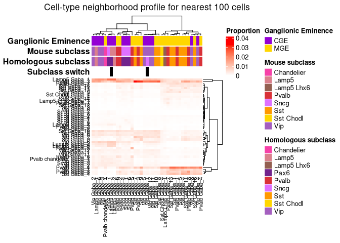<!-- -->

    ## [1] 45 37

``` r
#finer resolution for excitatory
Glut_supertypes <- Zeng_calls_direct %>% filter(grepl(" Glut", class_label) & !grepl("ENT", supertype_label)) %>% pull(supertype_label) %>% unique()
ht <- make_neighborhood_profile_heatmap(
  all_profiles = all_profiles_supertype %>% filter(target_level %in% Glut_supertypes),
  Zeng_calls_direct = Zeng_calls_direct,
  split_counts = split_counts,
  celltype_color_palette = celltype_color_palette,
  number_of_neighbors_profiled = number_of_neighbors_profiled
)
```

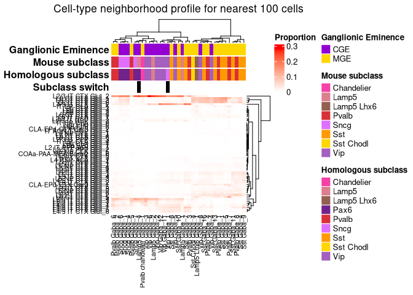<!-- -->

    ## [1] 57 37

``` r
#heat map for layers specifically

# ---- 1) Build matrix for ComplexHeatmap ----
mat_wide <- substructure_counts %>%
  select(supertype_label, target_parcellation, prop_supertype_in_parcellation) %>%
  group_by(supertype_label, target_parcellation) %>%
  summarise(prop = sum(prop_supertype_in_parcellation), .groups = "drop") %>%
  pivot_wider(
    names_from  = target_parcellation,
    values_from = prop,
    values_fill = 0
  )

# Row metadata aligned to the matrix row order
row_meta <- substructure_counts %>%
  distinct(supertype_label, cell_subclass, primate_subclass) %>%
  slice(match(mat_wide$supertype_label, supertype_label))


row_meta %<>% left_join(tibble(
  supertype_label = c(CGE_supertypes, MGE_supertypes),
  GE_origin = c(rep("CGE", length(CGE_supertypes)),
                rep("MGE", length(MGE_supertypes)))
))
```

    ## Joining with `by = join_by(supertype_label)`

``` r
mat <- mat_wide %>% select(-supertype_label) %>% as.matrix()
rownames(mat) <- mat_wide$supertype_label

# ---- Column order (explicit) ----
parcellation_order <- c("1", "2/3", "4", "5", "6a", "6b", 'Hippocampus')
col_order <- intersect(parcellation_order, colnames(mat))
mat <- mat[, col_order, drop = FALSE]


# ---- 3) Marking bar for specific rows ----
markers <- split_counts %>% pull(cell_cluster) %>% unique()
zeng_switch_vec <- factor(
  ifelse(rownames(mat) %in% markers, "marked", "other"),
  levels = c("other", "marked")
)
zengswitch_cols <- c(other = "white", marked = "black")

row_meta %>% pull(primate_subclass) %>% unique()
```

    ## [1] "Lamp5"      "Pax6"       "Lamp5 Lhx6" "Pvalb"      "Chandelier"
    ## [6] "Sst Chodl"  "Sst"        "Sncg"       "Vip"

``` r
row_anno <- rowAnnotation(
  origin    = row_meta$GE_origin,
  mouse_subclass    = row_meta$cell_subclass,
  primate_subclass = row_meta$primate_subclass,
  SpeciesSwitch       = zeng_switch_vec,
  col = list(
    mouse_subclass    = celltype_color_palette,
    primate_subclass = celltype_color_palette,
    SpeciesSwitch       = zengswitch_cols,
    origin = c('CGE' = 'darkviolet', 'MGE' = 'gold')
  ),
  annotation_width = unit.c(unit(4, "mm"), unit(4, "mm"), unit(2, "mm")),
  show_annotation_name = TRUE,
  annotation_name_gp = gpar(fontface = "bold")
)

# ---- 4) Heatmap color scale (robust to outliers) ----
mx <- as.numeric(quantile(mat, 0.99, na.rm = TRUE))
if (!is.finite(mx) || mx <= 0) {
  mx <- max(mat, na.rm = TRUE)
  if (!is.finite(mx) || mx <= 0) mx <- 1
}
col_fun <- colorRamp2(c(0, mx), c("white", "red"))

########Order based on primate subclass:
primate_order <- c(
  "Lamp5 Lhx6", "Lamp5", "Vip", "Sncg", "Pax6",
  "Sst", "Sst Chodl", "Pvalb", "Chandelier"
)

# Build an ordered key; NAs or unseen labels go last
primate_key <- factor(row_meta$primate_subclass,
                      levels = primate_order, ordered = TRUE)

# Order rows primarily by primate_subclass, then (optionally) by cell_subclass and rowname
row_order <- order(primate_key, row_meta$cell_subclass, rownames(mat), na.last = TRUE)


# ---- 5) Clustering ----
row_dend <- hclust(dist(mat), method = "ward.D2")  # keep row clustering

# ---- 6) Draw heatmap ----
ht <- Heatmap(
  mat,
  name             = "Proportion",
  col              = col_fun,
  left_annotation  = row_anno,
  cluster_columns  = FALSE,             
  column_order     = col_order,        
  row_title        = "supertype_label",

  split = primate_key,
  cluster_rows = TRUE,
  column_names_rot = 90,
  column_names_centered = T,
  row_names_gp     = gpar(fontsize = 11),
  column_names_gp  = gpar(fontsize = 11)
)

ht = draw(ht, heatmap_legend_side = "right", annotation_legend_side = "right")
```

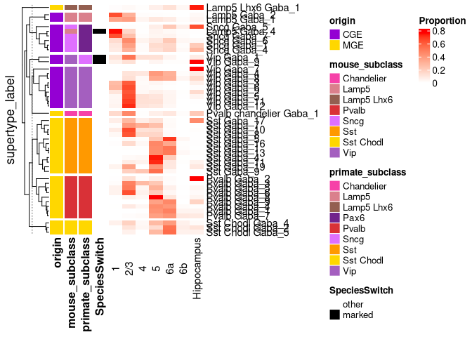<!-- -->

## Figure 6A mouse panels

``` r
load(file = 'data_for_plots/mouse_Vip_dot_plot_primate_enrich.Rdata')

order_vec = plotting_df %>% arrange(match(mapped_primate_subclass, c('Sst','Sst Chodl','Pvalb','Chandelier','Lamp5 Lhx6','Lamp5','Vip','Pax6','Sncg'))) %>%
  pull(study_primate_subclass)

plotting_df$study_primate_subclass = factor(plotting_df$study_primate_subclass, levels = order_vec)

mouse_vip_enrich_dot_plot = ggplot(plotting_df, aes(x = study_primate_subclass, y = mean_enrichment, color = mapped_primate_subclass)) +
  geom_point(size = 3, show.legend = F) + 
  geom_linerange(aes(ymin = mean_enrichment - sd_enrichment, ymax = mean_enrichment + sd_enrichment),
                 show.legend = F) +
  geom_hline(yintercept = 1, linetype = 'dashed', color = 'black') +
  ylab('Mean Primate Vip enrichment') + xlab('Mouse dataset Primate subclasses') + ylim(0,3) +
  scale_x_discrete(guide = guide_axis(n.dodge=2)) +
  scale_color_manual(values = celltype_color_palette) +
  theme_bw() + theme(panel.border = element_blank(), axis.line = element_line(),
                     panel.grid.major = element_blank(),
                     panel.grid.minor = element_blank(),axis.text.x=element_blank())

mouse_vip_enrich_dot_plot
```

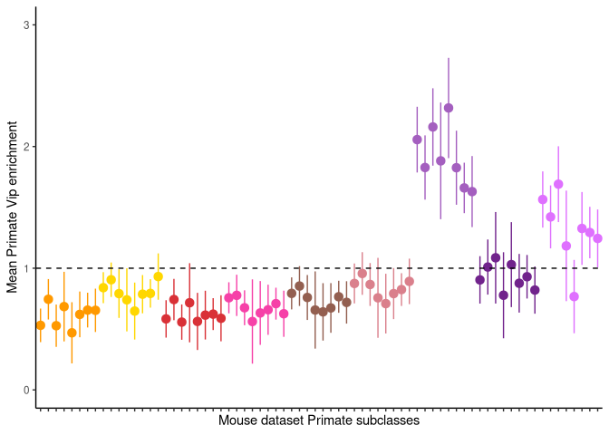<!-- -->

``` r
load(file = 'data_for_plots/mouse_Pax6_dot_plot_primate_enrich.Rdata')
order_vec = plotting_df %>% arrange(match(mapped_primate_subclass, c('Sst','Sst Chodl','Pvalb','Chandelier','Lamp5 Lhx6','Lamp5','Vip','Pax6','Sncg'))) %>%
  pull(study_primate_subclass)

plotting_df$study_primate_subclass = factor(plotting_df$study_primate_subclass, levels = order_vec)

mouse_pax6_enrich_dot_plot = ggplot(plotting_df, aes(x = study_primate_subclass, y = mean_enrichment, color = mapped_primate_subclass)) +
  geom_point(size = 3, show.legend = F) + 
  geom_linerange(aes(ymin = mean_enrichment - sd_enrichment, ymax = mean_enrichment + sd_enrichment),
                 show.legend = F) +
  geom_hline(yintercept = 1, linetype = 'dashed', color = 'black') +
  ylab('Mean Primate Pax6 enrichment') + xlab('Mouse dataset Primate subclasses') + ylim(0,3) +
  scale_x_discrete(guide = guide_axis(n.dodge=2)) +
  scale_color_manual(values = celltype_color_palette) +
  theme_bw() + theme(panel.border = element_blank(), axis.line = element_line(),
                     panel.grid.major = element_blank(),
                     panel.grid.minor = element_blank(),axis.text.x=element_blank())

mouse_pax6_enrich_dot_plot
```

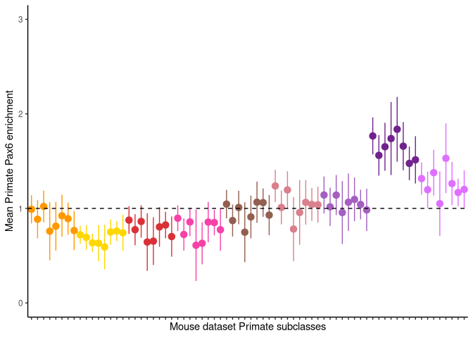<!-- -->

``` r
load(file = 'data_for_plots/mouse_Sncg_dot_plot_primate_enrich.Rdata')

order_vec = plotting_df %>% arrange(match(mapped_primate_subclass, c('Sst','Sst Chodl','Pvalb','Chandelier','Lamp5 Lhx6','Lamp5','Vip','Pax6','Sncg'))) %>%
  pull(study_primate_subclass)

plotting_df$study_primate_subclass = factor(plotting_df$study_primate_subclass, levels = order_vec)

mouse_sncg_enrich_dot_plot = ggplot(plotting_df, aes(x = study_primate_subclass, y = mean_enrichment, color = mapped_primate_subclass)) +
  geom_point(size = 3, show.legend = F) + 
  geom_linerange(aes(ymin = mean_enrichment - sd_enrichment, ymax = mean_enrichment + sd_enrichment),
                 show.legend = F) +
  geom_hline(yintercept = 1, linetype = 'dashed', color = 'black') +
  ylab('Mean Primate Sncg enrichment') + xlab('Mouse dataset Primate subclasses') + ylim(0,3) +
  scale_x_discrete(guide = guide_axis(n.dodge=2)) +
  scale_color_manual(values = celltype_color_palette) +
  theme_bw() + theme(panel.border = element_blank(), axis.line = element_line(),
                     panel.grid.major = element_blank(),
                     panel.grid.minor = element_blank(),axis.text.x=element_blank())

mouse_sncg_enrich_dot_plot
```

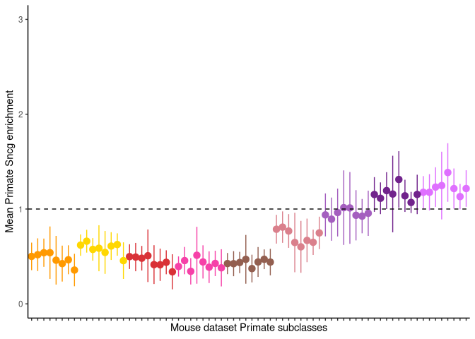<!-- -->

``` r
load(file = 'data_for_plots/mouse_Sncg_dot_plot_mouse_enrich.Rdata')

order_vec = plotting_df %>% arrange(match(mapped_primate_subclass, c('Sst','Sst Chodl','Pvalb','Chandelier','Lamp5 Lhx6','Lamp5','Vip','Pax6','Sncg'))) %>%
  pull(study_primate_subclass)

plotting_df$study_primate_subclass = factor(plotting_df$study_primate_subclass, levels = order_vec)

mouse_mouse_sncg_enrich_dot_plot = ggplot(plotting_df, aes(x = study_primate_subclass, y = mean_enrichment, color = mapped_primate_subclass)) +
  geom_point(size = 3, show.legend = F) + 
  geom_linerange(aes(ymin = mean_enrichment - sd_enrichment, ymax = mean_enrichment + sd_enrichment),
                 show.legend = F) +
  geom_hline(yintercept = 1, linetype = 'dashed', color = 'black') +
  ylab('Mean Mouse Sncg enrichment') + xlab('Mouse dataset Primate subclasses') + ylim(0,3.7) +
  scale_x_discrete(guide = guide_axis(n.dodge=2)) +
  scale_color_manual(values = celltype_color_palette) +
  theme_bw() + theme(panel.border = element_blank(), axis.line = element_line(),
                     panel.grid.major = element_blank(),
                     panel.grid.minor = element_blank(),axis.text.x=element_blank())

mouse_mouse_sncg_enrich_dot_plot
```

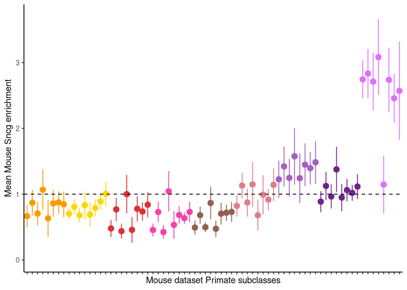<!-- -->
